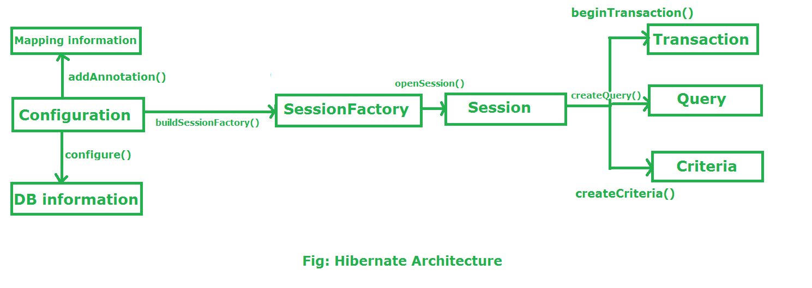

# Spring MVC without Spring Boot

An academic project done many years ago. It was kept for historical reasons.

It might be useful to realize technology development overs years and compare that technology (JSP and an old Spring release) with modern frameworks.

| Branch |                                                                                                    Pipeline                                                                                                    |                                                                                                 Code coverage                                                                                                  |                                        Test report                                         |
|:------:|:--------------------------------------------------------------------------------------------------------------------------------------------------------------------------------------------------------------:|:--------------------------------------------------------------------------------------------------------------------------------------------------------------------------------------------------------------:|:------------------------------------------------------------------------------------------:|
|  main  | [](https://gitlab.com/ShowMeYourCodeYouTube/spring-mvc-without-spring-boot/-/commits/main) | [](https://gitlab.com/ShowMeYourCodeYouTube/spring-mvc-without-spring-boot/-/commits/main) | [link](https://showmeyourcodeyoutube.gitlab.io/spring-mvc-without-spring-boot/test-report) |


---

**Table of contents**

- [Technology](#technology)
- [Project setup](#project-setup)
- [JAR vs WAR vs EAR](#jar-vs-war-vs-ear)
- [Servlet 2.5 vs Servlet 3](#servlet-25-vs-servlet-3-jsr-315)
- [DB convention](#db-convention)
- [Technical remarks](#technical-remarks)
- [Similar projects](#similar-projects)

## Technology

* Spring 6 (no Spring Boot!)
* Spring Security
* Hibernate
* AWS Corretto 17
* Jetty
* Maven
* JUnit / Hamcrest
* Layered Architecture
* Result artifact: WAR
* Jmeter configuration (SpringMVC.jmx)

IDEA plugins:
- Maven Helper
  - https://plugins.jetbrains.com/plugin/7179-maven-helper
- UML Generator
  - https://plugins.jetbrains.com/plugin/15124-uml-generator

### Spring MVC


Reference: https://vitalflux.com/steps-get-started-spring-mvc-4-hibernate-4/

### Layered Architecture

A Layered Architecture, as I understand it, is the organization of the project structure into four main categories: `presentation`, `application`, `domain`, and `infrastructure`. Each of the layers contains objects related to the particular concern it represents.
- The `presentation layer` contains all of the classes responsible for presenting the UI to the end-user or sending the response back to the client (in case we’re operating deep in the back-end).
- The `application layer` contains all the logic that is required by the application to meet its functional requirements and, at the same time, is not a part of the domain rules. In most systems that I've worked with, the application layer consisted of services orchestrating the domain objects to fulfill a use case scenario.
- The `domain layer` represents the underlying domain, mostly consisting of domain entities and, in some cases, services. Business rules, like invariants and algorithms, should all stay in this layer.
- The `infrastructure layer` (also known as the persistence layer) contains all the classes responsible for doing the technical stuff, like persisting the data in the database, like DAOs, repositories, or whatever else you’re using.


References:
- https://dzone.com/articles/layered-architecture-is-good
- https://herbertograca.com/2017/08/03/layered-architecture/

### Project architecture

This project follows the approach from ``https://www.thinktocode.com/2018/07/05/layered-architecture/``:
```
In a strict layered way we can only access the one layer exactly under it. 
If we use a more flexible approach, then we can access all the layers beneath the current layer. 
From experience I recommend the more flexible way. 
Otherwise we will create to much overhead code that does not provide any value.
```


## Project setup

1. Enable Lombok annotation processing in your IDE.
2. ``mvn clean install``
3. ``mvn jetty:run-war -DskipTests``
4. Open the home page: `http://localhost:8080/springmvc/`
5. If you want to log in, existing users can be found in `resources/2021-10-20-2-import.sql`.

---

By default Hibernate/JPA SQL statements are printed.

### Maven useful commands

- install and force to fetch all dependencies (force = fetch again in case of repository HTTP error) 
  - mvn clean install -U

## JAR vs WAR vs EAR


- EAR stands for Enterprise ARchive
- WAR stands for Web application ARchive
- JAR stands for Java ARchive

WAR (web archive) files contain servlet class files, JSPs (Java servlet pages), HTML and graphical files, and other supporting files.

EAR (enterprise archive) files contain the WAR files along with the JAR files containing code.

## Servlet specification

A servlet is a Web component that is managed by a container and generates dynamic content. Servlets are Java classes that are compiled to byte code that can be loaded dynamically into and run by a Java technology-enabled Web server or Servlet container.

A servlet-container supports only the servlet API (including JSP, JSTL).

An application server supports the whole JavaEE - EJB, JMS, CDI, JTA, the servlet API (including JSP, JSTL), etc.

| Servlet API version | Released	       | Platform             |
|---------------------|-----------------|----------------------|
| Java Servlet 4.0	   | Sep 2017	       | Java EE 8            |
| Java Servlet 3.1	   | May 2013	       | Java EE 7            |
| Java Servlet 3.0	   | December 2009	  | Java EE 6, Java SE 6 |
| Java Servlet 2.5	   | September 2005	 | Java EE 5, Java SE 5 |

References:
- https://dzone.com/articles/an-overview-servlet-30
- https://readlearncode.com/servlet-4-features/
- https://en.wikipedia.org/wiki/Jakarta_Servlet

## DB convention

- Avoid quotes.
- Lowercase. Identifiers should be written entirely in lower case. This includes tables, views, column, and everything else too.
- Underscores separate words.
- Data types are not names. Database object names, particularly column names, should be a noun describing the field or object.
- Full words, not abbreviations.
- Use common abbreviations.
  - For a few long words the abbreviation is both more common than the word itself e.g. "Internationalization" and "localization".
- Avoid reserved words.
- Table/View names
  - Tables, views, and other relations that hold data should have singular names, not plural.
- Primary Keys
  - Single column primary key fields should be named id.
- Foreign Keys
  - Foreign key fields should be a combination of the name of the referenced table and the name of the referenced fields. For single column foreign keys (by far the most common case) this will be something like `foo_id`.
- Constraints
  - Constraints should given descriptive names. This is especially true for check constraints e.g.
    - `CONSTRAINT team_member_pk PRIMARY KEY (team_id, person_id));`.
  - Constraints
    - PK: Primary Key
    - AK: Alternate Key
    - FK: Foreign Key
    - UK: Uniuqe
    - IX: IndeX
    - CK: ChecK
    - DF: DeFault

References: 
- https://launchbylunch.com/posts/2014/Feb/16/sql-naming-conventions/
- https://stackoverflow.com/questions/4836391/naming-convention-for-unique-constraint

## Technical remarks

### Serialization

Reference: https://docs.oracle.com/javase/6/docs/platform/serialization/spec/version.html

Serialization is the process of turning an object in memory into a stream of bytes, so you can do stuff like store it on disk or send it over the network.

Deserialization is the reverse process: turning a stream of bytes into an object in memory.

### H2 database configuration

```text
By default, closing the last connection to a database closes the database. 
For an in-memory database, this means the content is lost. To keep the database open, add ;DB_CLOSE_DELAY=-1 to the database URL. 
To keep the content of an in-memory database as long as the virtual machine is alive, use jdbc:h2:mem:test;DB_CLOSE_DELAY=-1.
```

Reference: https://stackoverflow.com/questions/5763747/h2-in-memory-database-table-not-found

### Web.xml - the deployment descriptor

```
A web application's deployment descriptor describes the classes,
resources and configuration of the application and how the web server uses them to serve web requests. 
When the web server receives a request for the application, 
it uses the deployment descriptor to map the URL of the request to the code that ought to handle the request.
```

Reference: https://cloud.google.com/appengine/docs/standard/java/config/webxml#:~:text=and%20URL%20paths-,web.,method%20for%20HTTP%20GET%20requests.

### MockMVC vs RestTemplate

```text
Spring MVC Test builds on the mock request and response from spring-test and does not require a running servlet container. 
The main difference is that actual Spring MVC configuration is loaded through the TestContext framework 
and that the request is performed by actually invoking the DispatcherServlet 
and all the same Spring MVC infrastructure that is used at runtime.
```

```text
If you have code using the RestTemplate,
you’ll probably want to test it and to that you can target a running server or mock the RestTemplate. 
The client-side REST test support offers a third alternative, 
which is to use the actual RestTemplate but configure it with a custom ClientHttpRequestFactory 
that checks expectations against actual requests and returns stub responses.
```

Reference: https://stackoverflow.com/questions/25901985/difference-between-mockmvc-and-resttemplate-in-integration-tests

### Hibernate

Hibernate is a framework which is used to develop persistence logic which is independent of Database software. In JDBC to develop persistence logic we deal with primitive types.

References:
- https://www.geeksforgeeks.org/hibernate-architecture/
- https://dzone.com/articles/introduction-to-jpa-architecture
- https://docs.jboss.org/hibernate/orm/5.4/userguide/html_single/Hibernate_User_Guide.html
- https://www.baeldung.com/hibernate-entitymanager
- https://www.baeldung.com/transaction-configuration-with-jpa-and-spring
- https://dzone.com/articles/how-does-spring-transactional

##### Entity lifecycle


#### Architecture



- **SessionFactory** is an Interface which is present in org.hibernate package and it is used to create Session Object. It is immutable and thread-safe in nature
- **Session** is an interface which is present in org.hibernate package. Session object is created based upon SessionFactory object i.e. factory. It opens the Connection/Session with Database software through Hibernate Framework.
- **Transaction** object is used whenever we perform any operation and based upon that operation there is some change in database.
  


The Java Persistence API (JPA) is the Java standard for mapping Java objects to a relational database. Mapping Java objects to database tables and vice versa is called object-relational mapping (ORM). The Java Persistence API (JPA) is one possible approach to ORM. Via JPA, the developer can map, store, update, and retrieve data from relational databases to Java objects and vice versa. JPA can be used in Java-EE and Java-SE applications. JPA is a specification and several implementations are available. Popular implementations are Hibernate, EclipseLink, and Apache OpenJPA.

- **EntityManagerFactory** — This is a factory class of EntityManager. It creates and manages multiple EntityManager instances.
- **EntityManager** — It is an interface; it manages the persistence operations on objects. It works like a factory for Query instance.
- **Entity** — Entities are the persistence objects, stored as records in the database.
- **EntityTransaction** — It has one-to-one relationship with EntityManager. For each EntityManager, operations are maintained by the EntityTransaction class.

There are two types of EntityManager: 
- Container-Managed
  -  The container is in charge of beginning the transaction, as well as committing or rolling it back.
- Application-Managed
  - The lifecycle of the EntityManager is managed by the application here.

#### Doubts

- EntityManager vs SessionFactory
  - Prefer EntityManagerFactory and EntityManager. They are defined by the JPA standard. SessionFactory and Session are hibernate-specific. The EntityManager invokes the hibernate session under the hood.
- Thread safe?
  - The EntityManagerFactory instances and, consequently, Hibernate's SessionFactory instances, are thread-safe.
  - On the other hand, the EntityManager instances are not thread-safe and are meant to be used in thread-confined environments. This means that each thread should obtain its instance, work with it, and close it at the end. However, the container (JakartaEE or Spring) injects a special proxy instead of a simple EntityManager here. Spring, for example, injects a proxy of type SharedEntityManagerCreator. Every time we use the injected EntityManager, this proxy will either reuse the existing EntityManager or create a new one. Reuse usually occurs when we enable something like Open Ses.
- JPA vs JTA
  - JPA (Java Persistence API) is the Java ORM standard/specification for storing, accessing, and managing Java objects in a relational database. Hibernate is an implementation of the Java Persistence API (JPA) specification.
  - JTA (Java Transaction API) is the Java standard/specification for distributed transactions. It comes into picture when you have transactions that spans across multiple connections/DBs/resources. Atomikos is an implementation of JTA. (Appservers like IBM Websphere has their own JTA implementations.)
- N+1 problem
  - Hibernate N+1 problem occurs when you use FetchType. LAZY for your entity associations. If you perform a query to select n-entities and if you try to call any access method of your entity's lazy association, Hibernate will perform n-additional queries to load lazily fetched objects
  - Solutions:
    - Eager loading (not recommended)
    - JOIN FETCH (if you need eager loading)
    - Eager Fetching With Result Limiting (pagination)
    - Write HQL with a DTO projection pulling out only the columns you need.
    - Use annotation Fetch(FetchMode.SUBSELECT) with lazy loading
      - JOIN: avoids the major issue of N+1 queries but it may retrieve data duplicated.
      - SUBSELECT: avoids N+1 too and doesn't duplicate data but it loads all the entities of the associated type into memory.
    - It is a common mistake that lazy-loading is accidentally triggered:
      - You may have accidentally accessed that field in your code, for example, in toString()/hashCode()/equals().
      - You are inspecting your object state through a debugger, which will in turns trigger toString() or access to the lazy-loading field.
    - References
      - https://hackernoon.com/3-ways-to-deal-with-hibernate-n1-problem
      - https://www.sipios.com/blog-posts/eliminate-hibernate-n-plus-1-queries

<details>
  <summary>N+1 Hibernate sample</summary>

  ```text
2023-09-24 14:11:04 [qtp501714839-29] DEBUG CategoryMapper:25 - Category ID: 1 Number of associated events: 8 Parameters: withEvents=true
Hibernate: 
    select
        e1_0.category_id,
        e1_0.id,
        e1_0.create_date,
        e1_0.created_by,
        e1_0.description,
        e1_0.image_path,
        e1_0.location,
        e1_0.name,
        e1_0.participants,
        e1_0.target_date 
    from
        event e1_0 
    where
        e1_0.category_id=?
2023-09-24 14:11:04 [qtp501714839-29] DEBUG EventMapper:25 - Event ID: 3 Number of associated users: 0 Parameters: withUsers=false
2023-09-24 14:11:04 [qtp501714839-29] DEBUG CategoryMapper:25 - Category ID: 2 Number of associated events: 1 Parameters: withEvents=true
Hibernate: 
    select
        e1_0.category_id,
        e1_0.id,
        e1_0.create_date,
        e1_0.created_by,
        e1_0.description,
        e1_0.image_path,
        e1_0.location,
        e1_0.name,
        e1_0.participants,
        e1_0.target_date 
    from
        event e1_0 
    where
        e1_0.category_id=?
2023-09-24 14:11:04 [qtp501714839-29] DEBUG CategoryMapper:25 - Category ID: 3 Number of associated events: 0 Parameters: withEvents=true
Hibernate: 
    select
        e1_0.category_id,
        e1_0.id,
        e1_0.create_date,
        e1_0.created_by,
        e1_0.description,
        e1_0.image_path,
        e1_0.location,
        e1_0.name,
        e1_0.participants,
        e1_0.target_date 
    from
        event e1_0 
    where
        e1_0.category_id=?
2023-09-24 14:11:04 [qtp501714839-29] DEBUG EventMapper:25 - Event ID: 4 Number of associated users: 0 Parameters: withUsers=false
  ```
</details>

<details>
  <summary>N+1 Hibernate sample (fixed using FetchMode.SUBSELECT)</summary>

  ```text
2023-09-24 14:13:57 [qtp737688361-29] INFO  CategoryService:21 - Getting all categories (withEvents=true)
Hibernate: 
    select
        c1_0.id,
        c1_0.description,
        c1_0.image_path,
        c1_0.name 
    from
        category c1_0
Hibernate: 
    select
        e1_0.category_id,
        e1_0.id,
        e1_0.create_date,
        e1_0.created_by,
        e1_0.description,
        e1_0.image_path,
        e1_0.location,
        e1_0.name,
        e1_0.participants,
        e1_0.target_date 
    from
        event e1_0 
    where
        e1_0.category_id in(select
            c1_0.id 
        from
            category c1_0)
2023-09-24 14:13:57 [qtp737688361-29] DEBUG EventMapper:25 - Event ID: 5 Number of associated users: 0 Parameters: withUsers=false
2023-09-24 14:13:57 [qtp737688361-29] DEBUG EventMapper:25 - Event ID: 6 Number of associated users: 0 Parameters: withUsers=false
2023-09-24 14:13:57 [qtp737688361-29] DEBUG EventMapper:25 - Event ID: 7 Number of associated users: 0 Parameters: withUsers=false
2023-09-24 14:13:57 [qtp737688361-29] DEBUG EventMapper:25 - Event ID: 8 Number of associated users: 0 Parameters: withUsers=false
2023-09-24 14:13:57 [qtp737688361-29] DEBUG EventMapper:25 - Event ID: 9 Number of associated users: 0 Parameters: withUsers=false
2023-09-24 14:13:57 [qtp737688361-29] DEBUG EventMapper:25 - Event ID: 10 Number of associated users: 0 Parameters: withUsers=false
2023-09-24 14:13:57 [qtp737688361-29] DEBUG EventMapper:25 - Event ID: 1 Number of associated users: 0 Parameters: withUsers=false
2023-09-24 14:13:57 [qtp737688361-29] DEBUG EventMapper:25 - Event ID: 2 Number of associated users: 0 Parameters: withUsers=false
2023-09-24 14:13:57 [qtp737688361-29] DEBUG CategoryMapper:25 - Category ID: 1 Number of associated events: 8 Parameters: withEvents=true
2023-09-24 14:13:57 [qtp737688361-29] DEBUG EventMapper:25 - Event ID: 3 Number of associated users: 0 Parameters: withUsers=false
2023-09-24 14:13:57 [qtp737688361-29] DEBUG CategoryMapper:25 - Category ID: 2 Number of associated events: 1 Parameters: withEvents=true
  ```
</details>

## Similar projects

- https://github.com/spring-petclinic/spring-framework-petclinic
